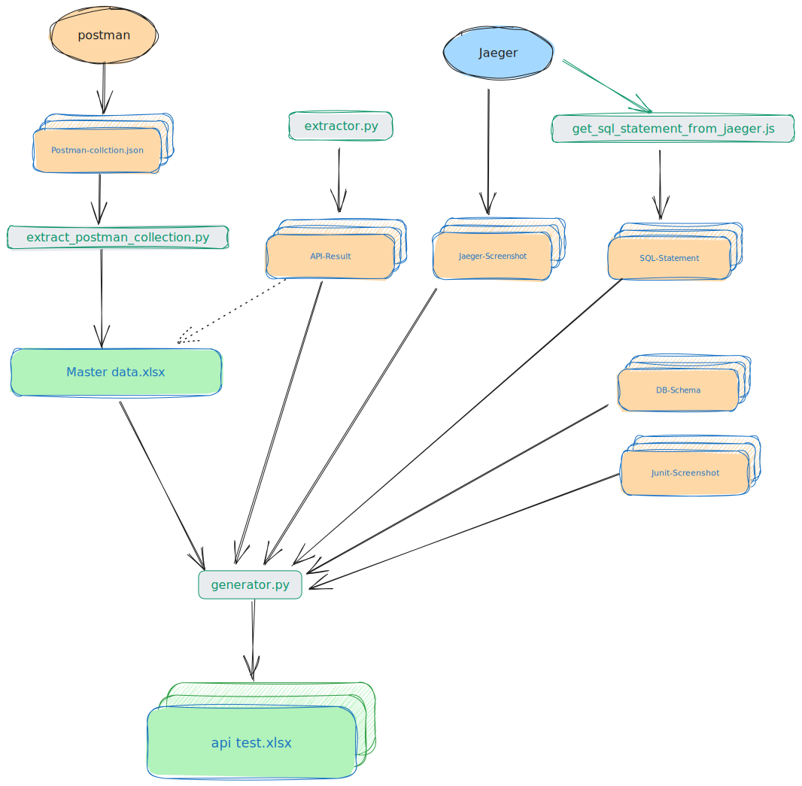

# api-test-report-generator

api-test-report-generator is a docs RPA , helpful for generating Project API Test Report Document.

## Input Data

**Necessary**

- `API Test Master Data.xlsx`
- `API-Result/`
- `DB-Schema/`
- `Jaeger-Screenshot/`
- `Junit-Screenshot/`
- `SQL-Statement/`

**Unnecessary**

- `Postman/`

## OpenShift login account

Check and input the AD account/psw in `config/secret.py`, it will be utilized in `python extractor.py`

## How to Prepare and Run it

1. Manually preparing **_Junit-Screenshot/_** and **_DB-Schema/_**
2. Manually preparing **_API Test Master Data.xlsx_**, then run `python extractor.py ` will get **_
   API-Result/ ,Jaeger-Screenshot/ ,SQL-Statement/_** data
    - also,can manually preparing **_API-Result/ ,Jaeger-Screenshot/ ,SQL-Statement/_** data

- **_postman_** data aim to enhance **_API Test Master Data.xlsx_** data,
  run `python extract_postman_collection.py`, will extract postman data to the excel

3. Finally, run `python generator.py`, will generate the api test dist file

### Sample run

- Prepare the required input files

- Then run follow cmd

```shell
python extract_postman_collection.py # unnecessary

python extractor.py
python generator.py
```

## Requirements

- Python 3.9+
- PIP
- Chrome v115+ / current(20231017) chrome ver is v118

- `pip install -r requirements.txt`

```shell
chromedriver_autoinstaller==0.6.2
openpyxl==3.1.2
pandas==1.4.4
Pillow==10.1.0
Requests==2.31.0
selenium==4.14.0
sql_metadata==2.9.0
sqlparse==0.4.4
urllib3==2.0.6

```

## A lazy way to get tokens

- After successfully logging into the portal(user/admin)
- Open the chrome console
- Copy the `user_token_download.js/admin_token_download.js`,paste into chrome console,press the Enter key
- Will auto download the token file in your OS download path
- When you run `python extractor.py`, it will use the token file, pls refer `extractor.py`
  and `config/user_token.json`

## ChromeDriver

Rest assured, the ChromeDriver file will automatically download during the process.

- Note!!! Windows need fix some defect, pls refer **README-CHROMEDRIVER-DEFECT-FIX.md**

## Workflow

